```mermaid
graph TB
    subgraph "Standalone Mode"
        SW[Single Worker]
        C1[Connector 1]
        C2[Connector 2]
        T1[Task 1]
        T2[Task 2]
        
        SW --> C1
        SW --> C2
        C1 --> T1
        C2 --> T2
        
        style SW fill:#FFB6C1
        Note1[❌ Single Point of Failure]
        SW -.-> Note1
    end
    
    subgraph "Distributed Mode"
        W1[Worker 1]
        W2[Worker 2]
        W3[Worker 3]
        
        C3[Connector 1]
        C4[Connector 2]
        
        T3[Task 1]
        T4[Task 2]
        T5[Task 3]
        
        W1 --> C3
        W2 --> C4
        W3 --> T3
        W3 --> T4
        W3 --> T5
        
        style W1 fill:#90EE90
        style W2 fill:#90EE90
        style W3 fill:#90EE90
        Note2[✅ High Availability]
        W1 -.-> Note2
        W2 -.-> Note2
        W3 -.-> Note2
    end
```

# Day 1: Kafka Connect Fundamentals & Architecture

## Welcome to Kafka Connect

You've learned to build producers and consumers in Spring Boot, handle events reliably, and process streams in real-time. But what if you need to integrate Kafka with databases, search engines, or external systems? Today, you'll learn about **Kafka Connect** — a powerful framework that simplifies data integration between Kafka and external systems without writing custom code.

Think of it like this:

- **Traditional approach**: Write custom producers/consumers for each system → lots of boilerplate code, error-prone, hard to maintain
- **Kafka Connect**: Declarative configuration → connect databases, search engines, and external systems with minimal code
- **Real-world analogy**: Like a universal adapter — plug in any system to Kafka without custom wiring

---

## What We'll Learn Today

By the end of this day, you'll understand:

- What Kafka Connect is and why it exists
- Kafka Connect architecture and components
- Source vs Sink connectors (conceptually)
- Distributed vs Standalone modes
- Connector lifecycle and task management
- Offset management concepts
- Error handling strategies (overview)
- When to use Kafka Connect vs alternatives
- Real-world use cases (high-level)

**Note**: Implementation details, code examples, and hands-on setup will be covered in subsequent days. Today focuses on understanding the architecture and concepts.

---

## What is Kafka Connect?

### Definition

**Kafka Connect** is a framework for connecting Kafka with external systems such as databases, key-value stores, search indexes, and file systems. It provides a scalable, reliable way to move data in and out of Kafka.

**Key Principle**: Declarative configuration over custom code. Instead of writing producers/consumers for each system, you configure connectors.

### The Problem It Solves

#### Without Kafka Connect

**Traditional Approach**:
- Write custom producer/consumer code for each external system
- Manually handle errors, retries, and offsets
- Duplicate integration logic across projects
- No standardization across different integrations

**Problems**:
- ❌ Write custom code for each system
- ❌ Handle errors, retries, offsets manually
- ❌ No standardization across integrations
- ❌ Hard to maintain and scale
- ❌ Duplicate code across projects

#### With Kafka Connect

**Kafka Connect Approach**:
- Declarative JSON configuration instead of code
- Built-in error handling, retries, and offset management
- Standardized framework for all integrations
- Reusable connectors for popular systems

**Benefits**:
- ✅ Declarative configuration (no custom code)
- ✅ Built-in error handling and retries
- ✅ Automatic offset management
- ✅ Standardized across all connectors
- ✅ Reusable connectors for common systems

### Visual: Traditional vs Kafka Connect

```mermaid
graph TB
    subgraph "Traditional Approach"
        DB1[(MySQL)]
        ES1[(Elasticsearch)]
        S3[(S3)]
        
        C1[Custom Producer<br/>for MySQL]
        C2[Custom Producer<br/>for Elasticsearch]
        C3[Custom Consumer<br/>for S3]
        
        K1[(Kafka)]
        
        DB1 --> C1
        ES1 --> C2
        C1 --> K1
        C2 --> K1
        K1 --> C3
        C3 --> S3
        
        style C1 fill:#FFB6C1
        style C2 fill:#FFB6C1
        style C3 fill:#FFB6C1
        Note1[❌ Lots of Custom Code]
        C1 -.-> Note1
        C2 -.-> Note1
        C3 -.-> Note1
    end
    
    subgraph "Kafka Connect Approach"
        DB2[(MySQL)]
        ES2[(Elasticsearch)]
        S32[(S3)]
        
        SC1[JDBC Source<br/>Connector]
        SC2[Elasticsearch Sink<br/>Connector]
        SC3[S3 Sink<br/>Connector]
        
        KC[Kafka Connect<br/>Framework]
        K2[(Kafka)]
        
        DB2 --> SC1
        SC1 --> KC
        KC --> K2
        K2 --> KC
        KC --> SC2
        SC2 --> ES2
        KC --> SC3
        SC3 --> S32
        
        style KC fill:#90EE90
        style SC1 fill:#ADD8E6
        style SC2 fill:#ADD8E6
        style SC3 fill:#ADD8E6
        Note2[✅ Declarative Configuration]
        KC -.-> Note2
    end
```



---

## Why Kafka Connect?

### Benefits

1. **Standardization**
   - Common framework for all integrations
   - Consistent error handling, monitoring, and configuration
   - Reusable connectors for popular systems

2. **No Custom Code**
   - Declarative configuration instead of writing producers/consumers
   - Focus on business logic, not integration plumbing
   - Faster development and deployment

3. **Built-in Reliability**
   - Automatic offset management
   - Error handling and retries
   - Exactly-once semantics support
   - Dead letter topics

4. **Scalability**
   - Distributed mode for high throughput
   - Automatic load balancing across workers
   - Horizontal scaling

5. **Operational Excellence**
   - REST API for management
   - Monitoring and metrics
   - Connector lifecycle management
   - Task management and rebalancing

### Use Cases

1. **Database Integration**: Sync MySQL, PostgreSQL, MongoDB to/from Kafka
2. **Change Data Capture (CDC)**: Capture database changes in real-time (Debezium)
3. **Search Integration**: Index events in Elasticsearch, Solr
4. **Cloud Storage**: Sync with S3, Azure Blob, GCS
5. **Message Queues**: Connect with RabbitMQ, ActiveMQ
6. **File Systems**: Read/write files from/to Kafka
7. **APIs**: Connect with REST APIs, webhooks

---

## When to Use Kafka Connect (And When NOT To)

### ✅ When Kafka Connect is a Good Fit

**1. Standard System Integration**
- **Use Case**: Integrating with common systems (databases, search engines, cloud storage)
- **Why**: Pre-built connectors available, no need to write custom code
- **Example**: Syncing MySQL to Kafka, indexing events in Elasticsearch

**2. High-Volume Data Movement**
- **Use Case**: Moving large amounts of data between systems
- **Why**: Kafka Connect handles batching, parallelism, and scaling automatically
- **Example**: Migrating data from legacy system to Kafka, bulk data sync

**3. Change Data Capture (CDC)**
- **Use Case**: Capturing database changes in real-time
- **Why**: Debezium connector provides CDC without application changes
- **Example**: Real-time database replication, event sourcing from database

**4. Multiple System Integrations**
- **Use Case**: Integrating with many different systems
- **Why**: Standardized approach, easier to manage and monitor
- **Example**: E-commerce system syncing with databases, search, analytics, notifications

**5. Operational Requirements**
- **Use Case**: Need monitoring, error handling, restart capabilities
- **Why**: Built-in operational features, REST API for management
- **Example**: Production systems requiring reliability and observability

### ❌ When NOT to Use Kafka Connect

**1. Custom Business Logic in Integration**
- **Problem**: Need complex transformations or business rules during integration
- **Example**: Enriching events with external API calls, complex data validation
- **Alternative**: Use Kafka Streams or custom producers/consumers

**2. Low-Volume, Simple Integrations**
- **Problem**: Overhead of Kafka Connect not justified
- **Example**: Simple REST API that publishes a few events per day
- **Alternative**: Direct producer/consumer in application

**3. Real-Time Processing with State**
- **Problem**: Need stateful processing, aggregations, joins
- **Example**: Real-time analytics, windowing, aggregations
- **Alternative**: Use Kafka Streams

**4. Application-Specific Events**
- **Problem**: Events are part of application business logic
- **Example**: Order processing, payment workflows
- **Alternative**: Use Spring Kafka producers/consumers in your application

**5. Tight Coupling with Application**
- **Problem**: Integration logic is tightly coupled with application code
- **Example**: Events generated as part of transaction processing
- **Alternative**: Use transactional outbox pattern with application code

### Decision Matrix

| Requirement | Kafka Connect | Custom Producer/Consumer | Kafka Streams |
|-------------|---------------|-------------------------|---------------|
| Standard system integration | Excellent | Possible | Not suitable |
| Custom business logic | Limited | Excellent | Excellent |
| High-volume data movement | Excellent | Possible | Not suitable |
| Real-time processing | Not suitable | Possible | Excellent |
| Change data capture | Excellent | Complex | Not suitable |
| Simple, low-volume | Overkill | Perfect | Overkill |
| Stateful operations | Not suitable | Possible | Excellent |

---

## Kafka Connect Architecture

### Core Components


### Component Breakdown

#### 1. Connect Workers

**Workers** are JVM processes that run connectors and tasks. They form a Connect cluster.

**Responsibilities**:
- Execute connector tasks
- Manage connector lifecycle
- Handle task distribution and rebalancing
- Store connector configurations
- Provide REST API

**Key Properties**:
- Multiple workers form a cluster (distributed mode)
- Workers coordinate via Kafka (internal topics)
- Automatic load balancing across workers

#### 2. Connectors

**Connectors** define what data to move and where. They are logical entities that coordinate tasks.

**Types**:
- **Source Connectors**: Pull data from external systems into Kafka
- **Sink Connectors**: Push data from Kafka to external systems

**Responsibilities**:
- Define data movement logic
- Generate task configurations
- Manage task lifecycle

#### 3. Tasks

**Tasks** are the actual units of work that move data. Each connector can have multiple tasks for parallelism.

**Responsibilities**:
- Read/write data
- Handle errors and retries
- Manage offsets
- Report metrics

**Key Properties**:
- Tasks run in parallel for scalability
- Each task processes a subset of data
- Tasks are distributed across workers

#### 4. Internal Topics

Kafka Connect uses internal Kafka topics for coordination:

- **`connect-configs`**: Stores connector configurations
- **`connect-offsets`**: Stores connector offsets (source connectors)
- **`connect-status`**: Stores connector and task status

---

## Source vs Sink Connectors

### Source Connectors

**Source Connectors** pull data from external systems and publish to Kafka topics.

**Flow**: External System → Source Connector → Kafka

**Examples**:
- File Source: Read from file system (covered in Day 2)
- JDBC Source: Read from databases
- Debezium Source: Capture database changes
- HTTP Source: Poll REST APIs

**Characteristics**:
- Pull-based (poll external system)
- Manage offsets (track what's been read)
- Generate Kafka records
- Handle schema evolution

### Sink Connectors

**Sink Connectors** consume from Kafka topics and write to external systems.

**Flow**: Kafka → Sink Connector → External System

**Examples**:
- File Sink: Write to file system (covered in Day 2)
- Elasticsearch Sink: Index events in Elasticsearch
- JDBC Sink: Write to databases
- S3 Sink: Write to cloud storage

**Characteristics**:
- Push-based (consume from Kafka)
- Use Kafka consumer groups
- Handle batching for efficiency
- Manage write operations

### Visual Comparison


---

## Connector Configuration

### Configuration Overview

Connectors are configured using **JSON configuration** with two main sections:
- **`name`**: Unique connector identifier
- **`config`**: Connector-specific configuration properties

### Configuration Categories

#### Connector-Level Properties (Common to All)
- **`connector.class`**: Fully qualified class name of the connector implementation
- **`tasks.max`**: Maximum number of parallel tasks (controls parallelism)

#### Source Connector Properties
- **`topic.prefix`**: Prefix for generated Kafka topic names
- **`poll.interval.ms`**: Frequency of polling external system
- **`mode`**: Offset tracking strategy (incrementing, timestamp, etc.)
- **Connection properties**: System-specific connection details (URLs, credentials)

#### Sink Connector Properties
- **`topics`**: Kafka topics to consume from (or `topics.regex` for pattern matching)
- **`batch.size`**: Number of records to batch before writing
- **Connection properties**: Target system connection details

### Configuration Management

- **Storage**: Configurations stored in `connect-configs` internal topic
- **Deployment**: Via REST API (POST to create, PUT to update)
- **Validation**: Connector validates configuration on startup
- **Versioning**: Configuration changes tracked in internal topics

**Note**: Detailed configuration examples and hands-on setup will be covered in Day 2 (File System Connectors) and subsequent days.

---

## Distributed vs Standalone Mode

### Standalone Mode

**Single worker process** running one or more connectors.

**Characteristics**:
- ✅ Simple setup (single JVM)
- ✅ Good for development and testing
- ✅ No coordination overhead
- ❌ No high availability
- ❌ Limited scalability
- ❌ Single point of failure

**Use Cases**:
- Development and testing
- Small deployments
- Single connector scenarios

**Configuration**: Simple properties file with bootstrap servers and converters

**Running**: Single JVM process running all connectors

### Distributed Mode

**Multiple worker processes** forming a cluster, sharing connector execution.

**Characteristics**:
- ✅ High availability (workers can fail)
- ✅ Horizontal scalability
- ✅ Automatic load balancing
- ✅ REST API for management
- ❌ More complex setup
- ❌ Requires coordination

**Use Cases**:
- Production deployments
- High-throughput scenarios
- Multiple connectors
- High availability requirements

**Configuration**: Properties file with cluster settings and internal topic configuration

**Running**: Multiple worker processes forming a cluster

**Worker Coordination**:
- Workers form a consumer group for coordination
- Connectors and tasks automatically distributed across workers
- Automatic rebalancing when workers join/leave
- REST API for connector management (create, update, delete, monitor)

### Visual Comparison



---

## Connector Lifecycle

### Lifecycle States

Connectors go through several states during their lifecycle:

1. **UNASSIGNED**: Connector created but not yet assigned to a worker
2. **RUNNING**: Connector is running and tasks are executing
3. **PAUSED**: Connector is paused (tasks stopped, configuration retained)
4. **FAILED**: Connector failed due to error
5. **DESTROYED**: Connector deleted

### Task Lifecycle

Tasks also have their own lifecycle:

1. **UNASSIGNED**: Task created but not assigned to worker
2. **RUNNING**: Task is executing
3. **PAUSED**: Task is paused
4. **FAILED**: Task failed due to error
5. **RESTARTING**: Task is restarting after failure

### Lifecycle Management

Connectors are managed via **REST API** (in distributed mode):
- **Create**: POST connector configuration
- **Read**: GET connector status, configuration, tasks
- **Update**: PUT connector configuration
- **Delete**: DELETE connector
- **Control**: Pause, resume, restart connectors and tasks

**Note**: Detailed REST API usage and examples will be covered in Day 2 (File System Connectors).

---

## Offset Management

### Source Connector Offsets

Source connectors need to track what data has been read to avoid duplicates and enable resumption.

**Offset Storage**: Stored in `connect-offsets` topic (internal Kafka topic)

**Offset Modes** (for JDBC source connectors):

1. **Incrementing Mode**: Track using auto-incrementing column
   - Tracks highest ID read
   - Simple and efficient
   - Only handles inserts (not updates)

2. **Timestamp Mode**: Track using timestamp column
   - Tracks latest timestamp read
   - Handles updates to existing rows
   - May miss records if multiple have same timestamp

3. **Timestamp + Incrementing Mode**: Track using both columns
   - Most robust (handles both inserts and updates)
   - Recommended for production use

4. **Bulk Mode**: Read entire table each time
   - No offset tracking
   - Reads all data on each poll
   - Use only for small, static tables

**How Offset Storage Works**:
- Offsets stored in `connect-offsets` internal Kafka topic
- Each source connector tracks its own offsets
- On restart, connector resumes from last stored offset
- Prevents duplicate processing and enables resumability

**Note**: Detailed offset configuration and examples will be covered in Day 3 (JDBC Connectors).

### Sink Connector Offsets

Sink connectors use **Kafka consumer offsets** (standard consumer group offsets).

**Offset Storage**: Stored in `__consumer_offsets` topic (standard Kafka)

**How it works**:
- Sink connector is a Kafka consumer
- Uses consumer group for offset management
- Commits offsets after successful writes
- Resumes from last committed offset on restart

---

## Error Handling

### Error Handling Strategies

Kafka Connect provides several error handling mechanisms:

#### 1. Retry with Exponential Backoff
- Automatic retries for transient failures
- Configurable retry timeout and delay
- Prevents connector failure on temporary issues

#### 2. Dead Letter Topics (DLQ)
- Failed records sent to dedicated Kafka topic
- Original record + error context preserved
- Enables investigation and reprocessing
- Connector continues processing other records

#### 3. Error Tolerance
- **`errors.tolerance = none`**: Fail on any error (default, strict)
- **`errors.tolerance = all`**: Continue processing, log errors (resilient)

### Error Handling Flow

**Without Error Handling**:
- Connector fails and stops on error
- Records may be lost
- Requires manual intervention

**With Error Handling**:
- Failed records routed to DLQ
- Connector continues processing
- Errors logged for monitoring
- DLQ can be reprocessed later

**Note**: Detailed error handling configuration and examples will be covered in Day 2 (File System Connectors) and Day 5 (Elasticsearch).

---

## Monitoring and Metrics

### REST API for Monitoring

Kafka Connect provides REST API endpoints for:
- **Connector Management**: List, get, create, update, delete connectors
- **Status Monitoring**: Get connector and task status
- **Configuration**: View and update connector configurations
- **Plugin Discovery**: List available connector plugins

### Status Information

Connector status includes:
- **Connector State**: RUNNING, PAUSED, FAILED, etc.
- **Task States**: Individual task status and worker assignment
- **Worker Assignment**: Which worker is running each connector/task

### JMX Metrics

Kafka Connect exposes JMX metrics for:
- **Source Task Metrics**: Records processed, failed, offset lag
- **Sink Task Metrics**: Records written, batch sizes, processing time
- **Connector Metrics**: Overall connector health and performance

**Note**: Detailed monitoring setup and usage will be covered in Day 2 (File System Connectors).

---

## Real-World Use Cases

### Use Case 1: File System Migration (File Source/Sink)

**Requirement**: Migrate files from one directory to another through Kafka, with optional transformations.

**Solution**: File Source Connector reads files and File Sink Connector writes them, with Kafka as the intermediary.

**Benefits**:
- Visual and easy to understand (first connector experience)
- Demonstrates source and sink working together
- Can add transformations using Single Message Transforms (SMT)
- Foundation for understanding connector patterns

**Covered In**: Day 2 - File System Connectors

### Use Case 2: Database to Kafka Sync (JDBC Source)

**Requirement**: Sync database tables to Kafka for event-driven processing.

**Solution**: JDBC Source Connector polls database and publishes to Kafka topics.

**Benefits**:
- Automatic polling and offset tracking
- Handles inserts and updates
- No application code changes required

**Covered In**: Day 3 - Database Integration with JDBC Connectors

### Use Case 3: Kafka to Elasticsearch Indexing (Elasticsearch Sink)

**Requirement**: Index events in Elasticsearch for search and analytics.

**Solution**: Elasticsearch Sink Connector consumes from Kafka and indexes documents.

**Benefits**:
- Batched writes for efficiency
- Automatic indexing
- Searchable data in real-time

**Covered In**: Day 5 - Elasticsearch & Search Integration

### Use Case 4: Change Data Capture (Debezium Source)

**Requirement**: Capture database changes in real-time without application changes.

**Solution**: Debezium connector reads database transaction logs (binlog) and publishes change events.

**Benefits**:
- Real-time change capture (no polling)
- Complete change history (inserts, updates, deletes)
- No application code changes

**Covered In**: Day 4 - Debezium CDC Deep Dive

### Use Case 5: Multi-System Integration

**Requirement**: Sync data from single Kafka topic to multiple systems.

**Solution**: Multiple Sink Connectors consuming from same topic.

**Architecture**:
```
orders topic
    ├─> Elasticsearch Sink → Elasticsearch (search)
    ├─> JDBC Sink → Data Warehouse (analytics)
    └─> S3 Sink → S3 (archival)
```

**Benefits**:
- Single source of truth (Kafka topic)
- Multiple consumers without coupling
- Independent scaling and failure handling
- Easy to add new consumers

---

## Getting Started Overview

### Setup Process (High-Level)

1. **Setup Kafka Connect**: Deploy Connect workers (distributed mode recommended)
2. **Install Connector Plugins**: Add required connectors to plugin path
3. **Create Connector Configuration**: Define JSON configuration for your connector
4. **Deploy Connector**: Use REST API to create and start connector
5. **Monitor Connector**: Check status, metrics, and data flow

### What's Next

**Day 2** will cover:
- Detailed setup instructions
- Installing File Source and Sink connectors
- Creating and deploying your first connector (file system migration)
- Direct file-to-file migration through Kafka
- Adding transformations using Single Message Transform (SMT)
- Monitoring and troubleshooting

---

## Common Challenges

### Challenge 1: Schema Evolution

**Problem**: Database schema changes can break connectors.

**Solution**: Use Schema Registry with Avro for schema evolution support.

**Covered In**: Day 3 (JDBC Connectors) and Day 4 (Debezium CDC)

### Challenge 2: High Volume Data

**Problem**: Connector can't keep up with high-volume data.

**Solutions**:
- Increase `tasks.max` for parallelism
- Tune batch sizes and polling intervals
- Scale workers horizontally
- Optimize external systems (indexes, etc.)

**Covered In**: Day 3 (Performance tuning)

### Challenge 3: Offset Management

**Problem**: Connector reads duplicate data or misses data.

**Solutions**:
- Use appropriate offset mode (timestamp+incrementing recommended)
- Monitor offset lag
- Handle offset resets carefully

**Covered In**: Day 3 (Offset modes deep dive)

### Challenge 4: Error Recovery

**Problem**: Connector fails and stops processing.

**Solutions**:
- Configure error tolerance and dead letter topics
- Implement retry logic
- Monitor and alert on failures

**Covered In**: Day 2 and Day 5 (Error handling patterns)

---

## Best Practices

- Use distributed mode for production (high availability, scalability)
- Configure appropriate task count (match partitions/tables)
- Use Schema Registry for schema evolution
- Monitor connector health (status, offset lag, alerts)
- Handle errors gracefully (error tolerance, dead letter topics)
- Use timestamp+incrementing offset mode for production
- Tune performance (task count, batch sizes, polling intervals)
- Secure connections (SSL/TLS, secure credentials)

**Note**: Detailed best practices with examples will be covered in subsequent days.

---

## Summary

- **Kafka Connect**: Framework for integrating Kafka with external systems using declarative configuration
- **Architecture**: Workers execute connectors and tasks, coordinated via internal Kafka topics
- **Source Connectors**: Pull data from external systems into Kafka (manage offsets)
- **Sink Connectors**: Push data from Kafka to external systems (use consumer groups)
- **Distributed Mode**: Production-ready with high availability, scalability, and REST API
- **Use When**: Standard system integration, high-volume data movement, CDC, multiple integrations
- **Don't Use When**: Custom business logic, low-volume simple integrations, real-time processing with state

---

## Next Steps

**Day 2: File System Connectors - Your First Connector**
- Set up Kafka Connect in distributed mode
- Install and configure File Source and Sink connectors
- Implement file-to-file migration through Kafka
- Direct migration (no transformation)
- Enhanced migration with transformations (SMT)
- Monitor connectors and data flow

**Coming Up**:
- **Day 3**: Database Integration with JDBC Connectors
- **Day 4**: Debezium CDC - Real-time change capture
- **Day 5**: Elasticsearch & Search Integration
- **Day 6**: Custom Connector Development

---

## Resources

- [Kafka Connect Documentation](https://kafka.apache.org/documentation/#connect)
- [Confluent Kafka Connect Guide](https://docs.confluent.io/platform/current/connect/index.html)
- [Kafka Connect REST API](https://kafka.apache.org/documentation/#connect_rest)
- [Confluent Hub](https://www.confluent.io/hub/) - Connector marketplace

---

## Conclusion

You now have a solid understanding of Kafka Connect fundamentals and architecture. You know:

- **What Kafka Connect is**: A framework for integrating Kafka with external systems
- **Why it exists**: Eliminates custom code, standardizes integrations, provides built-in reliability
- **How it works**: Workers, connectors, tasks, and internal topics coordinate to move data
- **When to use it**: Standard system integrations, high-volume data movement, CDC, multiple integrations
- **When NOT to use it**: Custom business logic, low-volume simple integrations, real-time processing with state

**Next Steps**: In Day 2, you'll get hands-on with File System connectors, setting up Kafka Connect, creating your first connectors for file-to-file migration, and implementing transformations using Single Message Transforms (SMT).

Happy Connecting! 🚀

